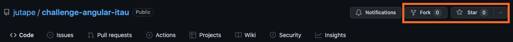

# Desafio Angularjs Itau


## 💁‍♂️ Sobre o itau 

O Itaú Unibanco é o maior banco privado do Brasil, a maior instituição financeira da América Latina e uma das maiores do mundo.

Nossa marca é apontada pelo 16º ano consecutivo como a mais valiosa do país, segundo o ranking Interbrand, entre outros importantes reconhecimentos.

## 📋 O que avaliaremos

Iremos avaliar o seu conhecimento em html, css e js aplicados no framework Angularjs.

## 🔧 Configurando o ambiente

Siga esse passo a passo para iniciar seu projeto:

**1. Dê um like e faça um fork do projeto**



**2. Faça o clone do projeto no seu computador**

```sh
git clone "https://github.com/**seu-usuario**/itau-angular-test.git"
```
*no lugar do seu ˜\*\*seu-usuario\*\*˜ coloque o seu usario do github.

**3. Criando uma nova branch.**

```sh
git checkout -b "interview/nome-sobrenome"
```

**4. Instalando o angular**

```sh
npm install -g @angular/cli
```

**5. Iniciando o projeto**

```sh
ng new .
```

**6. Agora é rodar o projeto**

```sh
npm start
```

## 🚀 Desafio frontend

O objetivo do desafio é desenvolver um formulario de email para entrevista de uma empresa, você deverá seguir o modelo que esta na imagem abaixo e neste [link do figma](https://www.figma.com/file/dVWdCvHTi7k2wIvaOMUfF9/Desafio-Frontend-Itau?node-id=0%3A1).


No formulário os possiveis valores para a vaga são:

- Backend
- Frontend
- QA

e para o Nivel deverão ser:

- Jr.
- Pl.
- Sn.

Após você obter o resultado da resposta do formulário, você deverá enviar uma requisição para a api de disparo de email. Vá para a documentação da API através desse [link](https://github.com/jutape/email-sender).

A mensagem do email deve ser montada da seguinte forma:

> Olá, {Nome} {sobrenome} se candidatou para a vaga de {vaga} {nivel}.

## 📋 Requisitos

### Obrigatório

1. Escrever o código com Angularjs  ;)
2. Validar campos obrigatórios!
3. Defina uma estrutura do projeto.

### Extras (Opcionais)

1. Fazer testes unitários.
2. Utilizar algum extensão css.
3. Fazer a página responsiva.

## 🔨 Ferramento de desenvolvimento

Fique a vontade para usar a ferramenta mais confortável para você ;)
Aqui usamos muito o [VS code](https://code.visualstudio.com/)